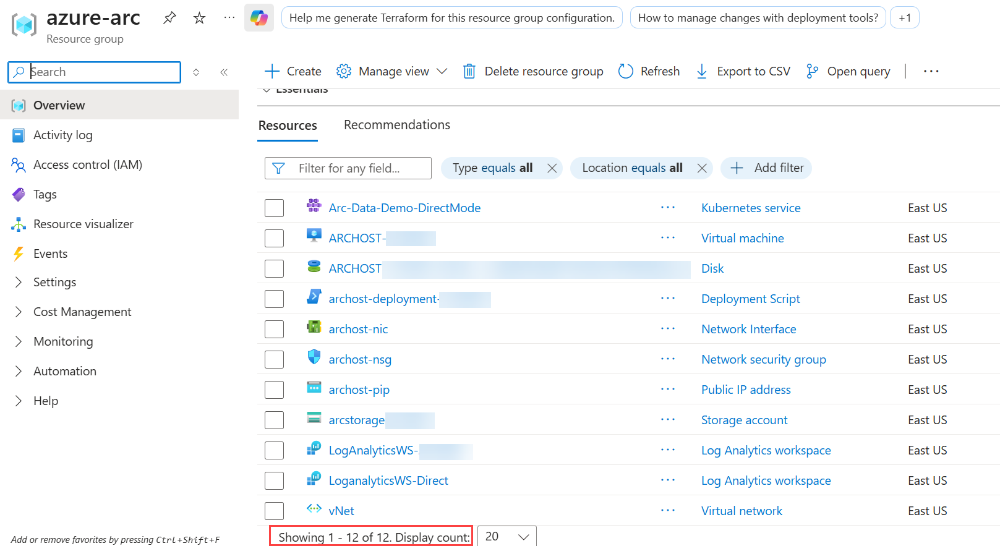

# Hands-on Lab 01
# Exercise 1: Getting Started with Azure Arc
### Estimated Duration: 60 Minutes

## Lab Scenario

In this exercise, you will learn how to onboard and manage on-premises resources and Kubernetes clusters using Azure Arc. Contoso aims to centralize management of its hybrid infrastructure by integrating servers and Kubernetes environments into Azure.

You will onboard a Linux machine and a Kubernetes cluster hosted on Hyper-V to Azure Arc, verify their connectivity, and apply Azure Policy to ensure compliance. Additionally, you will enable Azure Monitor to gain centralized visibility and performance insights, demonstrating how Azure Arc simplifies governance and monitoring across hybrid and multi-cloud environments.

## Objectives

In this exercise, you will be performing the following tasks:

- Task 1: Getting Started with Hyper-V Infrastructure.
- Task 2: Onboard Linux Machine to Azure Arc.
- Task 3: Onboard Kubernetes Cluster to Azure Arc.
- Task 4: Verify if the Kubernetes cluster is connected to Azure Arc.
- Task 5: Create a policy assignment to identify compliant/non-compliant resources.
- Task 6: Monitor Arc-enabled machines with Azure Monitor.
  
## Task 1: Getting Started with Hyper-V Infrastructure

Hyper-V is Microsoft's hardware virtualization product. It lets you create and run a software version of a computer, called a virtual machine. Each virtual machine acts like a complete computer, running an operating system and programs. When you need computing resources, virtual machines give you more flexibility, help save time and money, and are a more efficient way to use hardware than just running one operating system on physical hardware. In this task, you will walk through an on-prem environment that is hosted on Hyper-V. You will find three virtual machines hosted on the Hyper-V server, which you will onboard to Azure Arc and play around with.

1. Navigate to the **Resource Groups** in the Azure portal navigation section.

        
  
1. Click on the **azure-arc** Resource group.

     

1. Confirm whether you have a total of 12 records to confirm that all the below resources are deployed successfully.
 
    

   * In the Resource group we have one **Virtual Machine**, **Kubernetes Service**, **Storage account** and **Log Analytics workspace** deployed.

   * **Virtual Machine:** You will be using the Virtual Machine, which is already open on the left side of the page, to perform all the Lab exercises.

   * **Kubernetes Services:** We have already deployed the Azure Arc Data controller onto the Kubernetes Service and in later exercises we will be deploying Azure Arc-enabled data resources onto the Kubernetes cluster using Azure Arc data services.

   * **Storage Account:** You will use this storage account to backup and restore the database to SQL MI.
   
   * **Log Analytics workspace:** You will be using one of the Log Analytics workspaces to upload and view the logs generated from both Postgres Hyperscale and SQL MI servers.

   > **Note:** If you see either **12 or 13 records**, you can proceed further with the next steps.

1. Now, double-click on the **Hyper-V Manager** from the desktop of the provided Virtual Machine to start the Hyper-V Manager.

    

1. Then, you need to select **ARCHOST-<inject key="DeploymentID" enableCopy="false" />** to connect with the Local Hyper-V server.

    

    >**Note:** <inject key="DeploymentID" enableCopy="false" /> is a six/seven digit unique number that can be found under the Environment tab, check variable with name **DeploymentId/Suffix**

1. You will find two guest virtual machines running on the Hyper-V manager. Find a list of guest virtual machines with private IP addresses.
     
     * **ubuntu-k8s** - ```192.168.0.8```
     
     * **sqlvm** - ```192.168.0.4```
  
        
         
        > **Note:** If you see VMs are in the stopped state, and when you click on the Start button, if VMs are not getting started or if it is throwing any error. Then, right-click on Virtual Machine in stopped state and then click on **Delete saved state**. After that, you can start the VMs and proceed to the next task.

## Task 2: Onboard Linux Machine to Azure Arc

Now, let’s onboard the Linux Machine to Azure Arc as an Arc-enabled server. This VM also has the Kubernetes cluster that we will use in the subsequent labs. So, here we will onboard the ubuntu-k8s VM to Azure Arc

1. From the start menu of the ARCHOST VM (Lab-VM), search for **putty (1)** and select **PuTTY (2)**.

    
     
1. In the Putty Configuration tool, enter the **ubuntu-k8s** VM private IP - ```192.168.0.8``` **(1)**, make sure the Port value is ```22``` **(2)**. Once you enter the private IP of the ubuntuk8s VM, click on the **Open (3)** to launch the terminal.

    
    
1. Enter the **ubuntu-k8s** VM username - ```demouser``` in **login as** and then hit **Enter**.

    - **Username** : Enter `demouser`

      ```BASH
      demouser
      ```

1. Now, enter the password - ```demo@pass123``` and press **Enter**. Remember, the password will be hidden and not be visible in the terminal.

    - **Password** : Enter `demo@pass123`

      ```BASH
      demo@pass123
      ```

    
        > **Note:** To paste any value in the Putty terminal, just copy the value from anywhere and then right-click on the terminal to paste the copied value.
    
1. Login to the **Root user account** using sudo command; enter the following command and then provide **password** - ```demo@pass123``` when prompted for the password.

    - Command:
      ```BASH
      sudo su
      ```

    - Password:
      ```BASH
      demo@pass123
      ```
    
        

1. Open a new Putty session, re-perform the steps from **Step 2** to **Step 5** of the same task to get the upgraded packages and then continue from  **Step 8**.
    
1. Next, you have to navigate back to the desktop of **Lab VM**, and click on the `installArcAgentLinux.txt` file to open it.
   
   > **Note:** If you see any pop-up like **An update package is available, do you want to download it?** click **no**

   

   > **Note:** If you see any pop-up, select **Notepad ++ (1)**, check the box for **Always use this app to open .txt files (2)** and click **OK (3)**.

   

1. Then, **select the first 7 lines and, then right click and copy**. 

1. Then, go back to the **putty session** and paste it into the ubuntu-k8s VM by doing a right click, and it will start executing. 

   

1. Once it is executed, you have declared the values of AppID, AppSecret, TenantID, SubscriptionID, ResourceGroup, and location and then logged into Azure using the 7th line. You can also find the values of these variables in the **Environment Details** tab. These variables are required for the next steps.

    
    
1. Run the following commands:

   ```
   export MSFT_ARC_TEST=true
   sudo systemctl set-environment MSFT_ARC_TEST=true
   ```

1. Run the following commands:

   ```
   sudo ufw --force enable
   sudo ufw deny out from any to 169.254.169.254
   sudo ufw default allow incoming
   ```

1. Now, to download the Azure Arc installation package for Linux, run the below command:

   ```
   wget https://aka.ms/azcmagent -O ~/Install_linux_azcmagent.sh
   ```
    
   
    
1. Then, to install Azure Arc agent on the VM, run the below command:

   ```
   bash ~/Install_linux_azcmagent.sh
   ```

   
    
1. Once the installation is successful, you will see the following message in the terminal **Latest version of azcmagent is installed**.

       
    
1. Finally, connect the **ubuntu-k8s machine to Azure Arc** by running the connect command given below.  Once you run the command given below, it will take 1-2 minutes to onboard the machine to Azure Arc. 
    
   ```
   azcmagent connect --resource-group $ResourceGroup --tenant-id $TenantID --location $location --subscription-id $SubscriptionId -i $AppID -p $AppSecret
   ```

   > Remember, we are using variables declared earlier in step 13.
     
   

1. Let's verify the onboarding of **ubuntu-k8s** machine on Azure Arc from Azure portal. Switch to the browser tab where you have logged into the Azure portal already in step 1, and browse to the **azure-arc** resource group

1. Now click on **Refresh (1)** from the Azure Arc overview page.

1. Then verify if **ubuntu-k8s (2)** resource of resource type: **Machine - Azure Arc** got created. Click on the resource to get more information.

   

1. On **ubuntu-k8s** Machine - Azure Arc **Overview** page, verify that the Status is **Connected**. You can also check other details from this tab like Computer name, Operating system, Operating system version and Agent version of the Ubuntu machine.
   
   > **Note:** The operating system and Agent version that you see may not match the provided screenshot if there were any updates to the Agent/ OS Version.

   

## Task 3: Onboard Kubernetes Cluster to Azure Arc

We have onboarded the Linux VM to Azure Arc and verified it in task 2. Now, you will onboard the local Kubernetes cluster to Azure Arc. So, here we are onboard **MicroK8s** Kubernetes cluster to Azure Arc which is hosted on **ubuntu-k8s** VM. We already have the Microk8s Kubernetes cluster ready and configured with the Arc-enabled CLI extensions.

   > **Note:** If you have closed PuTTY after completing **Task 2**, then perform the **First 10 steps** of **Task 2** again and then return to perform this task. Make sure that you perform all steps with the root user in the ubuntu-k8s VM.

1. To install **helm**, you need to run the following commands within the terminal of the ubuntu-k8s VM that is opened in Putty:
            
     > **Info:** Helm is a Kubernetes deployment tool for automating the creation, packaging, configuration, and deployment of applications and services to Kubernetes clusters. The Kubernetes app's manifests are stored in helm charts.

   ```
   curl -fsSL -o get_helm.sh https://raw.githubusercontent.com/helm/helm/master/scripts/get-helm-3
   chmod 700 get_helm.sh
   ./get_helm.sh
   ```

   **Note:** In case you see `Could not find git. It is required  for plugin installation.` Warning: Please ignore it and continue with the lab.
    
   

1. Next, you have to run the below command to ensure the Azure CLI version and custom location extension for Az CLI are the latest.

    ```
    az extension add --name customlocation
    ```
    
    >**Note:** If you face any exceptions while updating the CLI version, please rerun the command again.

1. Run the below command to install **connectedk8s** extension.

    ```
    az extension add --name connectedk8s
    ```

1. Then, you will update the Arc-enabled Kubernetes CLI extension to ensure that we are always using the latest k8s extension for Azure CLI.

    >**Note:** If the message "Unable to load extension connectedk8s: No module named azure.graphrbac" appears, rerun the command.

   ```
   az extension update --name connectedk8s
   ```
    
   
    
1. Now, you can check the status of the Kubernetes cluster by running ```microk8s.status``` in **ubuntu-k8s** VM. To check the status once the command is executed, you have to scroll up to the top of the output to view the status. 

   - Command to check the status of the Kubernetes cluster
     ```
     microk8s.status
     ```

          

1. If the status is **microk8s is running**, you can proceed to the next step. But, if it is in a **stopped** state or in not **running** state, you have to run the ```microk8s start``` command to restart the Kubernetes cluster.

   - Command to start the Kubernetes cluster
     ```
     microk8s start
     ```
     > **Note:** This command takes a while to execuite, please wait until it executes successfully.

     

1. Run the following commands one by one and press **Enter** in any prompt about Country or state.

   ```
   mkdir cadir
   ```

   ```
   openssl genrsa -out cadir/ca.key 2048
   ```

   ```
   openssl req -x509 -new -nodes \
     -key cadir/ca.key \
     -sha256 -days 360 \
     -out cadir/ca.crt \
     -addext "keyUsage=critical,digitalSignature,keyCertSign"
   ```

   

1. Execute the following commands one by one to refresh the microk8s certificates.

   ```
   microk8s refresh-certs cadir
   ```

   ```
   microk8s stop
   microk8s start
   ```

   

1. Now execute the following commands one by one.

   ```
   sudo microk8s config > new-config.yaml
   ```

   ```
   mkdir -p ~/.kube
   cp new-config.yaml ~/.kube/config
   ```

   ```
   kubectl get nodes
   ```

   ```
   az aks install-cli
   ```

   ```
   az extension remove -n connectedk8s
   az extension add -n connectedk8s
   ```

   

1. Now, you will connect the **Kubernetes cluster to Azure Arc** by executing the below command. This command will take a few minutes to onboard the Kubernetes cluster to Azure Arc.

   ```
   az connectedk8s connect --name microk8s-cluster --resource-group $ResourceGroup -l $location
   ```
   
   

    > **Note:** This may take around `5 to 10 minutes` to complete, please wait until it is completed.   
  
1. Once the previous command is executed successfully, the **provisioning state** in the output will show as **Succeeded**.

       

## Task 4: Verify if the Kubernetes cluster is connected to Azure Arc

Now, let us verify if the Kubernetes cluster is connected to Azure Arc and is in a healthy state.

1. Verify whether the cluster is connected by running the following command:
   
   ```
   az connectedk8s list -g $ResourceGroup -o table
   ```
     
   
   
1. Navigate to the Resource Group from the Azure portal navigation pane and click on the Resource Group named **azure-arc**. 

   

1. Click on **Refresh (1)** on the azure-arc overview page and then look for the resource named **microk8s-cluster** of resource type **Azure Arc enabled Kubernetes resource (2)**.

   

1. Azure Arc enabled Kubernetes to deploy a few operators into the azure-arc namespace. You can view these deployments and pods by running the command in the terminal of the ubuntu-k8s VM:

   ```
   kubectl -n azure-arc get deployments,pods
   ```
   
   The output should be similar as shown below:
   
   
   
## Task 5: Create a policy assignment to identify compliant/non-compliant resources

In this task, a policy assignment will be created and applied to the ubuntu-k8s Arc-enabled server to ensure that the Azure Monitor Agent (AMA) is automatically installed and configured through Azure Policy. This allows Azure to continuously evaluate the machine’s compliance state and remediate configuration drift.

1. From the **Azure Portal**, search for **Azure Arc (1)** in the search box and select **Azure Arc (2)** from the services. 

    

1. From the left navigation pane, expand **Infrastructure (1)** and select **Machines (2)**.

    
    
1. Click on the **ubuntu-k8s** server from connected machines. 

    
    
1. From **ubuntu-k8s** server blade, expand **Operations (1)** and select **Policies (2)** from the left navigation pane.

    
    
1. Click on **Assign policy** to assign a policy to the connected **ubuntu-k8s** machine.

    
    
1. In the **Assign policy** window, under the **Basics** section, click the **ellipsis (…)** next to **Policy definition**.

    
    
1. In **Available Definitions** page, search for `Configure Linux Arc-enabled machines to run Azure Monitor Agent` **(1)** and select **Configure Linux Arc-enabled machines to run Azure Monitor Agent (2)** and then click on **Add (3)** button at the bottom.

    
    
1. Now, rename the **Assignment name** to **Configure Linux Arc-enabled machines to run Azure Monitor Agent (1)** and click on **Parameters (2)** blade.

    

1. On **Parameters** blade, click on **Next**.

    

1. On **Remediation** blade, enable the checkbox for **Create a remediation task (2)** and then click on the **Next (3)** button.

    
    
    > **Note:** If you are not able to see the checkbox, wait for few seconds.  

1. On **Managed identity** blade, click on **Next**.

    

1. On **Non-compliance messages** blade, enter ```Log Analytics agent is not installed``` **(1)** message. This message will appear when a Linux machine policy assignment status is in **non-compliant** state. Then, click **Review + create (2)**.

    
    
1. On **Review + create** blade, verify the assignments and select **Create** to confirm.

    
    
1. Now, once the policy assignment is created, click on **Refresh (1)** to see the assigned policy in the **Not started (2)** state or **Non complaint (2)**. 

    

    

1. After the policy assignment is created, the policy will appear in the list with the Compliance state as Not started. This indicates that Azure Policy evaluation and remediation have not yet begun.

    Once the policy engine starts evaluation, it will trigger remediation to deploy the Azure Monitor Agent (Log Analytics Agent) on the ubuntu-k8s Hyper-V guest VM. After the agent is successfully installed and evaluated, the compliance state will automatically change to Compliant.

    

    >**Note:** This process can take approximately 20–30 minutes. You may proceed to the next task.

> **Congratulations** on completing the task! Now, it's time to validate it. Here are the steps:
 
- Hit the Validate button for the corresponding task. If you receive a success message, you can proceed to the next task.
- If not, carefully read the error message and retry the step, following the instructions in the lab guide.
- If you need any assistance, please contact us at cloudlabs-support@spektrasystems.com. We are available 24/7 to help you out.
 
<validation step="936f9acc-302b-4616-b597-f8ce17fe1949" />

## Task 6: Monitor Arc-enabled machines with Azure Monitor

Azure Monitor can collect data directly from your hybrid machines into a Log Analytics workspace for detailed analysis and correlation. Typically, this would entail installing the Log Analytics agent on the machine using a script, manually or automatically following your configuration management standards. Arc-enabled servers recently introduced support to install the Log Analytics and Dependency agent VM extensions for Windows and Linux, enabling Azure Monitor to collect data from your non-Azure VMs.

1. In **ubuntu-k8s** Machine - Azure Arc blade, from the left navigation pane, expand **Monitoring (1)** and select **Insights (2)**.

    
    
1. Verify that the Arc Server Status shows **Connected**, confirming the machine is successfully connected and healthy.

    

1. Scroll down on the Insights page and verify that the Metrics sections (CPU / Availability / Memory, Network, and Disk) are visible.

    

1. Click on **Configure**.

    

1. Then click on **Review + enable**.

    

1. And click on **Enable**.

    

1. Wait for the Onboarding process to complete.

    

1. From the top menu bar, click on **Metrics based visualizations (Preview)** and select **Log based visualizations (Classic)**.

    

    >**Note:** Refresh the page, if you are not able to see **Metrics based visualizations (Preview)**.

1. Once the Insights are ready, click on the **Performance** blade to review Logical Disk Operations, CPU Utilization, Available Memory, Logical Disk IOPS, Logical Disk MB/s, and much more. It is exciting to see the graphical representation of VM performance, whether the VM is deployed on-prem, on other cloud provider platforms, or on any edge technologies.

    

    

## Summary 

In this exercise, you explored the fundamentals of setting up Hyper-V infrastructure, onboarded a Linux machine to Azure Arc, and integrated a Kubernetes cluster into Azure Arc while verifying the setup. Additionally, you created a policy assignment to identify compliant and non-compliant resources across your environment. Finally, you enabled monitoring for Arc-enabled machines using Azure Monitor to ensure real-time tracking and performance insights, streamlining management and governance across hybrid and multi-cloud environments.

### You have successfully completed the exercise. Click on **Next >>** from the bottom right corner to proceed with the next exercise.


