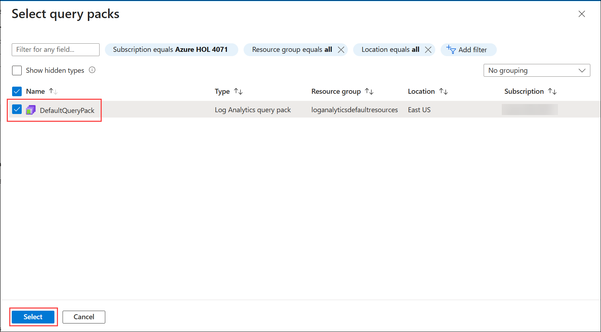

# Exercise 2: Onboard Azure Arc-enabled servers to Microsoft Sentinel and Microsoft Defender for Cloud
### Estimated Duration: 30 Minutes
This exercise focuses on integrating Azure Arc-enabled servers with Microsoft Sentinel and Microsoft Defender for Cloud to enhance security monitoring and threat detection across hybrid environments. Participants will enable Microsoft Defender for Cloud to monitor non-Azure servers and onboard them to Microsoft Sentinel for security event collection.

## Objectives

In this exercise, you will be performing the following tasks:

- Task 1: Enable Microsoft Defender for Cloud.
- Task 2: Onboard Azure Arc-enabled servers to Microsoft Sentinel
   
## Task 1: Enable Microsoft Defender for Cloud.
Microsoft Defender for Cloud can monitor the security posture of your non-Azure computers, but first, you need to connect them to Azure.
You can connect your non-Azure computers in any of the following ways:
  
  * Using Azure Arc enabled machines **(recommended)**
  
  * From Microsoft Defender for cloud pages in the Azure portal **(Getting started and Inventory)**
 
1. In the **Azure Portal**, search for **Microsoft Defender for Cloud (1)** in the search bar and click **Microsoft Defender for Cloud (2)**.
    
   
   
1. From the **Overview** page, under Workload protection, click on **Enable Defender plans** .   

   

   > **Note:** If you can't find the **Enable plans for Defender** option, move to **Step 5** and verify whether the subscription is loaded successfully,if its loaded proceed from there.

1. On the **Upgrade (1)** tab, scroll down and then **check on all the checkboxes (2)** and click on **Upgrade (3)**.

   
   
   > **Note**: If you are unable see Log Analytics, wait for few seconds.

1. From the top, click on **Microsoft Defender for Cloud | Overview**.

   

1. On the **Overview** page, select **Azure subscription.**
   
   
   
1. Now, select the subscription listed and click on **Install agents**.
   
   > **Note**: If you see that the **Install Agents button is not available**, it means that the agent will get automatically installed with the help of Defender and log analytics.

   

1. Click on **Inventory** under **General** section from the Microsoft Defender for Cloud.

   

1. You find the **ubuntu-k8s** Arc-enabled machine available in the resources list because the **LogAnalytics** agent is already enabled for it, and the same Log Analytics workspace is connected to Microsoft Defender for Cloud. 

   > **Note**: Agent monitoring will take a few minutes to update and show the status as **Monitored** for Arc-enabled machine **ubuntu-k8s** as shown in the screen below. You can continue to the next exercise and come back later to check on this.

   > Please note that due to some latest updates, the status is not changing to **Monitored** for Arc-enabled machine **ubuntu-k8s**, this is a temporary issue and will be fixed in future updates.   

   


## Task 2: Onboard Azure Arc-enabled servers to Microsoft Sentinel

Microsoft Sentinel comes with several connectors for Microsoft solutions, available out of the box and providing real-time integration. For physical and virtual machines, you can install the Log Analytics agent that collects the logs and forwards them to Microsoft Sentinel. Arc-enabled servers support deploying the Log Analytics agent using the following methods:

#### Using the VM extensions framework:
This feature in Azure Arc-enabled servers allows you to deploy the Log Analytics agent VM extension to a non-Azure Windows and/or Linux server. VM extensions can be managed using the following methods on your hybrid machines or servers managed by Arc-enabled servers:
 
 * The Azure portal
 
 * The Azure CLI
 
 * Azure PowerShell
 
 * Azure Resource Manager templates

#### Using Azure Policy:
You can use the Azure Policy Deploy Log Analytics agent to Linux or Windows Azure Arc machine's built-in policy to audit if the Arc-enabled server has the Log Analytics agent installed. If the agent is not installed, it automatically deploys it using a remediation task. Alternatively, if you plan to monitor the machines with Azure Monitor for VMs, use the Enable Azure Monitor for VMs initiative to install and configure the Log Analytics agent.

   > **Note**: You have already installed Log Analytics Agent into the Linux VM - ubuntu-k8s in the previous exercise. You can refer to **Task 5** in the previous exercise to review it again. Also, the screenshots of the log results can be mismatched because the results can take more time to get the same results. 

1. Search for **Microsoft Sentinel (1)** on the Azure portal and select **Microsoft Sentinel (2)** from the results.

      
    
1. On **Microsoft Sentinel** blade, click on **+ Create** to add Microsoft Sentinel to a workspace. 

      
    
1. Select the existing log analytics workspace shown named **LogAnalyticsWS-<inject key="DeploymentID" enableCopy="false" /> (1)**
  and then click on the **Add (2)** button.

      
      
1. You will see a notification in the upper right corner **Adding Microsoft Sentinel**. It will take around 1 minute to get added.
    
1. Once the Microsoft Sentinel is added, you will see another notification which says **Successfully added Microsoft Sentinel** as shown below.
     
      
 
1. If promted, click on **OK**.

      

1. Click on the **Overview** on the Microsoft Sentinel page from where you can view the insights after a few minutes. If you are not able to view the insights after a few minutes, then refresh the browser tab.
    
      

1. Expand **Content management (1)**, click on the **Content hub (2)** and click on the **Click here to go to the Defender portal (3)**.

      

      >**Note:** If the option is not visible, click on any other tab and again click on **Content hub**.

1. In the **Microsoft Defender** portal, go to **Microsoft Sentinel (1)** > **Content management (2)** > **Content hub (3)**.

1. Use the search bar and type **Syslog (4)**, then press Enter and select **Syslog (5)** from the results.

1. Click **Install (6)** and wait for the installation to complete before proceeding.

      >**Note:** If the screen does not appear as shown in the screenshot, sign out of the portal and log back in.

         
    
1. In **Microsoft Sentinel (1)** (within Microsoft Defender), under the **Threat management (2)** section in the left pane, **click Workbooks (3)**.
   - Navigate to the **Template tab (4)**.
   - Select **Linux machines (5)**.
   - Click **Save (6)**

         

1. Select **East US (1)** under **Save workbook to..** pop-up and click on **Yes (2)**

      
    
1. Now, go back to **Microsoft Sentinel Overview** blade by clicking on **Overview (1)** under General section on the left. Disable the **New Overview (2)** toggle and then click on **INSIGHTSMETER (3)** to query the **ubuntu-k8s** VM insights. The count of **Events** could be different on your Microsoft Sentinel Dashboard.

      >**Note:** Skip this step if your screen does not match the screenshot provided. This option may not appear due to recent UI changes.

      

1. Click on **Logs (1)** under **General** of **Microsoft Sentinal**, switch to **KQL mode (2)**, enter the query `union InsightsMetrics`, and click **Run (3)** to execute it.

      ```
      union InsightsMetrics
      ```
      

      >**Note:** Click on the **X** to close the pop-up.

      

1. You will see **Results** for ```union InsightsMetrics``` in query explorer. You can see operations around the Network, Logical Disk, Memory, and Processor for **ubuntu-k8s** VM. If you are not able to see the results, then try to adjust the query editor size and you will be able to see the outcome.

      
    
      > **Note**: The data might take around 30 mins to get populated.

1. Let us check for **ubuntu-k8s** processes by running the following query, you can change the time range limit as well to see the result of a specific time interval. You can scroll right on the **Results** section and see more details and descriptions about every process. 

      > **Note**: The data might take time to get populated. You can continue with next steps.

      ```
      VMProcess 
      | where TimeGenerated > ago(24h) 
      | limit 10
      ```
   
      > **Note**: In the above query, against TimeGenerated,  ago(24h) means "24 hours ago" so this query only returns records from the last 24 hours.

         
    
1. You can save the query for later use by clicking on the **Save (1)** and then **Save as query (2)** button.

       
   
1. Now, provide `VMProcess` for the **Query name (1)**, then click on **Save (2)**.

      >**Note:** If the saved query is not visible in the **Queries hub**, uncheck Path, change the resource group to the current one (azure-arc), enable Save to the default query pack, and then click Save.

       

1. You can see and run the saved **queries** by browsing to **Queries hub**
   
       
   
1. Under **Queries hub** seach for `VMProcess` **(1)** and click on **Run (2)** to run the query.
   
       

       

      

      > **Note:** Please select **Query packs** as shown in the image and proceed with searching for the VM process. Before that, select **Other** and perform the search there.   

      > **Note**: The data might take time to get populated. You can continue with next exercise.

> **Congratulations** on completing the task! Now, it's time to validate it. Here are the steps:
 
   - Hit the Validate button for the corresponding task. If you receive a success message, you can proceed to the next task.
   - If not, carefully read the error message and retry the step, following the instructions in the lab guide.
   - If you need any assistance, please contact us at cloudlabs-support@spektrasystems.com. We are available 24/7 to help you out.
 
<validation step="98bec6a2-c611-434b-adee-e6227f006309" />

   >**Note**: This might take some time to display a "Success" status. Please check back once after completing Exercise 3.
   
## Summary
 
In this exercise, you onboarded an Azure Arc-enabled machine to Microsoft Sentinel, enhancing its security and threat detection capabilities. Additionally, you enabled Microsoft Defender for Cloud to further strengthen security posture, ensuring comprehensive protection and monitoring across your hybrid infrastructure.

### You have successfully completed the exercise. Click on **Next >>** from the bottom right corner to proceed with the next exercise.

 
