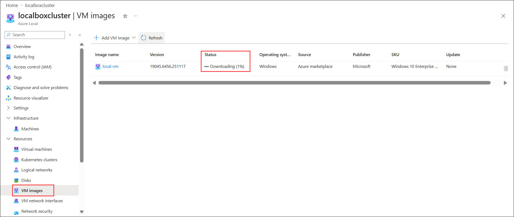

# Exercise 3: Azure Local VM Provisioning

### Estimated Duration: 60 Minutes

## Overview

In this exercise, you will learn how to provision virtual machines (VMs) on Azure Local. The process involves setting up a logical network, uploading a VM image to Azure Local storage, and then creating a new virtual machine using this image within the Azure Local environment. This practical exercise provides a step-by-step walkthrough of deploying VMs on the Azure Local infrastructure.

## Objectives

You will be able to complete the following tasks:

- Task 1: Create a Logical Network for Azure Local VM
- Task 2: Download and add the VM image to Azure Local Storage
- Task 3: Create a Virtual Machine on Azure Local

## Task 1: Create a Logical Network for Azure Local VM

In this task, you will create a logical network in the localboxcluster to enable VM connectivity with defined IP ranges, VLAN, DNS, and gateway.

1. On the **Azure portal**, in search bar type **Resource groups (1)** and select **Resource groups (2)** under the services. 

    

2. From the Resource groups pane, click on **Azure-Local** resource group and verify the resources present in it.

    

3. In the  **Azure-Local** resource group in the search bar search for **localboxcluster** **(1)** and select **localboxcluster** **(2)** Azure Local.

    

    >**Note:** If **Action Required: Update this Azure Local instance​** pop-up appears, click on **Ok**.

4. In the **localboxcluster** Azure Local, from the left menu select **Logical networks** **(1)** under Resources, and click on **+ Create logical network** **(2)**.
 
    

5. In the **Create logical network** tab, under Basic, fill in the following details and click on **Next: Network Configuration** **(5)**.

    - Subscription: Default subscription **(1)**
    - Resource group : **Azure-Local** **(2)**
    - Logical network name: **localbox-vm-lnet-vlan200** **(3)**
    - Virtual switch name: **ConvergedSwitch(compute_management_storage)** **(4)**

      

6. In the **Network Configuation** tab, under the following deatils and click on **Next: Tags** **(7)**.

    | **Variables**                | **Values**                                                    |
    | ---------------------------- |---------------------------------------------------------------|
    | IP address assignment | **Static** **(1)** |
    | IPv4 address space    | **192.168.200.0** **(2)** from the drop down  address prefix select **/24** **(3)** |
    | Default Gateway       | Enter Default Gateway address as **192.168.200.1** **(4)** |
    | DNS Servers           | Enter DNS Servers **192.168.1.254** **(5)** |
    | VLAN ID               | Enter **200** **(6)** | 

      

7. In the **Tag** tab, leave it as default and click **Next: Review + Create**.

8. In the **Review + Create** tab, click on on **Create** button.

    

## Task 2: Download and Add the VM image to Azure Local Storage

In this task, you will download a Windows 10 Enterprise multi-session VM image from the Azure Marketplace and store it in Azure Local.

1. In the **localboxcluster** Azure Local, from the left menu select **VM images** **(1)** under **Resources**, click on **+ Add VM Image** **(2)**, and click on **From Azure Marketplace** **(3)**.

    

1. In the **Create an image** tab, enter the fallowing details and click on **Review + create** **(6)** button.

   - Resource group: **Azure-Local** **(1)**
   - Save image as: Enter Image name as **local-vm** **(2)**
   - Custom location: From the drop-down select **jumpstart** **(3)**
   - Image to download: Select **select Windows 10 Enterprise multi-session, version 22H2 - Gen2** **(4)** VM image.
   - Storage path: select **Choose automatically** **(5)**

     

1. In the **Review + Create** tab, click on **Create** button.

    

   > **Note**: VM images download may take 1.5-2 hours to complete.
    
1. Wait for the download to complete. You can monitor the download Progress by going to **localboxcluster** Azure local and select the **VM Images (1)**. Once the VM image download is completed, you will see the Status as **Available (2)**.

    
    

1. Now, you can move to the next task of creating the Virtual Machine on Azure Local.

## Task 3: Create a Virtual Machine on Azure Local

In this task, you will provision a new VM in the localboxcluster using the logical network and VM image configured in the previous tasks.

1. In the **localboxcluster** Azure Local, from the left menu select **Virtual machines (1)** under Resources, then click on **+ Create VM (2)**.

    

2. On the **Create an Azure Arc virtual machine** page, enter the following details: 

   - Subscription: Default subscription **(1)**
   - Resource group: **Azure-Local** **(2)**
   - Virtual Machine name: **Win10-StackVM** **(3)**
   - Security type: **Standard** **(4)**
   - Storage path: **Choose Automatically (5)**
   - Image: **Select the VM image that you downloaded in the previous step (6)**
   - Virtual Processor count: **4 (7)**
   - Memory (MB): **8192 (8)**
   - Memory Type: **Static (9)**
   - Enable Guest Management: **Keep it checked (10)**
      
      
      
- **Administrator account**
   
    - Username: **arcdemo (1)**
    - Password: **ArcPassword123!! (2)**
    - Confirm password: **ArcPassword123!! (3)**
    - Keep unchecked the **Enable domain join (4)**
    - Then click on **Next (5)**

      

4. On the **Disks** tab, click on **Add new disk (1)** and enter the following details. After adding the details, click on **Add (6)** and **Next (7)**. 

   - Name: **wind10-disk** **(2)**
   - Size (GB): **128** **(3)**
   - Provisioning type: **Dynamic** **(4)**
   - Storage path: **Choose automatically (5)**

     

5. On the **Networking** tab, click on **Add network interface (1)** and enter the following details. After adding the details, click on **Add (6)** and **Next (7)**.

   - Name: **win10-nic** **(2)**
   - Network: **localbox-vm-lnet-vlan200** **(3)**
   - IPv4 type: **Static** **(4)**
   - Allocation Method: **Automatic (5)**

     

6. Click on **Next**, then **Create** to start the VM deployment.

   

    >**Note:** The deployment may take around 10 minutes to succeed. 

1. Once the deployment is complete, click on **Go to resource.** 

     

6. On the newly created VM page, review the VM configuration.

   

## Summary

In this exercise, you created the complete environment for running a VM in Azure Local. You created a logical network, added a Windows 10 Enterprise VM image from the Azure Marketplace, and deployed a fully configured virtual machine. This demonstrated the end-to-end process of preparing, networking, and provisioning compute resources in Azure Local.

### You have successfully completed the exercise. Click on Next >> to proceed with the next exercise.

